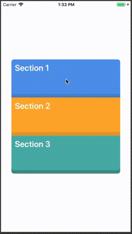

# Using animations to expand elements in different sections

To continue the practice (and useful implications of adding animations), decided to implement this example as an user in reddit was trying to understand how animations can be added to transition into a different state.

## What is the problem?

If we have a few sections that are collapsible (or can be expanded), a great way to get to the final state is with a small animation. Thankfully for us, flex deals with the layout, meaning we can activate it when we need it to calculate the maximum size you want for it and deactivate it when you want to to rollback to the previous known state. The interpolation will take care of the rest.

## What is going to be end result?

Basically,

Obviously, slower than this 😅

## Problems we might ran into

Animating anything outside the layout properties might have some performance implications you need to keep present at all times.

For instance, when we animate the `flex` property in the style, `react native` will have to recalculate the layout for us and rerender it and unfortunatelly, that property has not been optimised with the native renderer that can be turned on by calling `useNativeDriver` as documented [here](https://facebook.github.io/react-native/docs/animations.html). So, limit the number of animations you trigger using this method and your application is going to be happy Jan.
